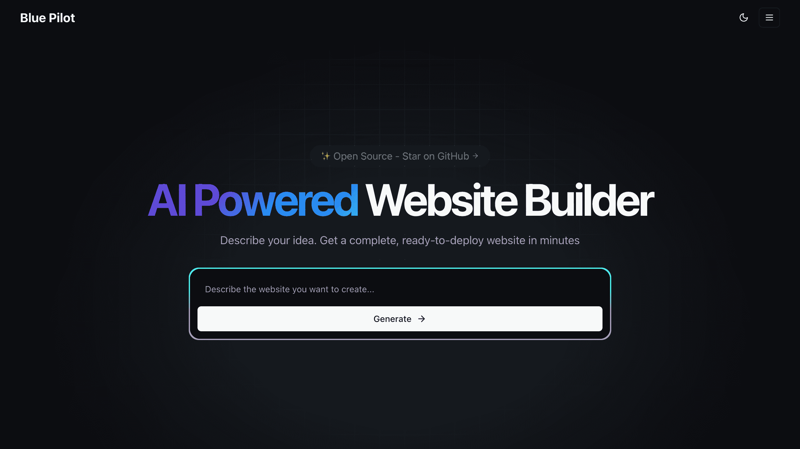

# Blue Pilot



## AI-Powered Website Builder

Blue Pilot is an AI-powered website builder that helps businesses and individuals create professional, responsive websites in minutes without coding skills. Our intelligent automation and intuitive design tools simplify web development.

## Table of Contents

- [Overview](#overview)
- [Features](#features)
- [Getting Started](#getting-started)
  - [Prerequisites](#prerequisites)
  - [Installation](#installation)
- [Usage](#usage)
- [Project Structure](#project-structure)
- [Technologies](#technologies)
- [Contributing](#contributing)
- [License](#license)
- [Contact](#contact)

## Overview

Blue Pilot leverages artificial intelligence to revolutionize the way websites are created. Our platform enables users to generate complete, customized websites through an intuitive interface, eliminating the need for technical expertise or extensive design skills.

Inspired by innovative tools in the AI-powered development space such as [Bolt.new](https://bolt.new), [Lovable](https://lovable.dev), [Vercel v0](https://v0.dev), [Tempo Labs](https://www.tempo.new),

## Features

- **AI-Driven Design**: Generate website layouts and designs based on your preferences
- **No-Code Solution**: Build professional websites without writing a single line of code
- **Responsive Design**: All websites are automatically optimized for any device
- **Quick Deployment**: Launch your website in minutes, not days
- **SEO Optimization**: Built-in tools to enhance your site's visibility

## Getting Started

### Prerequisites

- Node.js (v18 or later)
- npm package manager

### Installation

1. Clone the repository:

   ```bash
   git clone https://github.com/vivekvt/bluepilot.git
   cd bluepilot
   ```

2. Install dependencies:

   ```bash
   npm install
   ```

3. Set up environment variables:

   ```bash
   cp .env.example .env.local
   # Edit .env.local with your configuration
   ```

4. Run the development server:

   ```bash
   npm run dev
   # or
   yarn dev
   ```

5. Open [http://localhost:3000](http://localhost:3000) in your browser to see the application.

## Usage

1. **Sign In**: Sign in to create project.
2. **Create a New Project**: Start a new website by giving prompt to generate one
3. **Preview**: Test how your website looks on different devices
4. **Publish**: Deploy your website with a single click

## Project Structure

The project is built with Next.js and follows its conventional structure:

```
bluepilot-frontend/
├── app/                # Next.js 13+ app directory
│   ├── api/            # API routes
│   ├── auth/           # Authentication related pages
│   ├── components/     # Shared React components
│   ├── globals.css     # Global styles
│   ├── layout.js       # Root layout
│   └── page.js         # Home page
├── public/             # Static assets
├── .next/              # Next.js build output
├── package.json        # Project dependencies and scripts
└── README.md           # Project documentation
```

## Technologies

- **Frontend**: Next.js, React, Tailwind CSS
- **State Management**: React Context API
- **Authentication**: Supabase Auth
- **AI Integration**: Google Gemini, Claude, Openrouter, Vercel AI SDK
- **Deployment**: Vercel

Blue Pilot leverages [WebContainers](https://webcontainers.io/) technology by [StackBlitz](https://stackblitz.com/) to provide an interactive development experience directly in the browser.

## Contributing

We welcome contributions to Blue Pilot! Please follow these steps:

1. Fork the repository
2. Create your feature branch (`git checkout -b feature/amazing-feature`)
3. Commit your changes (`git commit -m 'Add some amazing feature'`)
4. Push to the branch (`git push origin feature/amazing-feature`)
5. Open a Pull Request

## License

This project is licensed under the MIT License - see the LICENSE file for details.

## Contact

- Website: [https://www.bluepilot.tech](https://www.bluepilot.tech)
- Twitter: [@bluepilot\_](https://x.com/bluepilot_)

---

© 2025 Blue Pilot Tech. All rights reserved.
